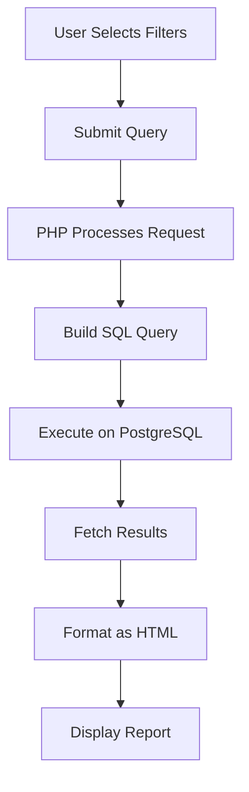

## Overview

The Operational Reports module provides comprehensive reporting capabilities for police operations, including daily shift reports (partes de novedades), statistical summaries, and operational analysis across jurisdictions. These reports are essential for command staff to monitor activities and make informed decisions.

## Types of Reports

<CardGroup cols={2}>
  <Card title="Shift Reports (Parte)" icon="clipboard">
    Daily reports documenting incidents, operations, and activities during specific shifts
  </Card>
  
  <Card title="Statistical Summaries" icon="chart-bar">
    Aggregated data showing operations metrics across regions and time periods
  </Card>
  
  <Card title="Operations Listings" icon="list">
    Detailed listings of operations filtered by various criteria
  </Card>
  
  <Card title="Integrated Operations" icon="diagram-project">
    Reports specifically for multi-unit coordinated operations
  </Card>
</CardGroup>

## Shift Reports (Parte de Novedades)

Shift reports document daily activities and incidents during specific time periods.

### Creating a Shift Report

<Steps>
  <Step title="Access Shift Report Form">
    Navigate to `parte1.php` (07:00-19:00 shift) or `parte2.php` (19:00-07:00 shift)
  </Step>
  
  <Step title="Enter Report Date">
    Specify the date for the report (day-month-year format)
  </Step>
  
  <Step title="Select Jurisdiction">
    Choose the Regional Unit (Unidad Regional) and specific police station (Dependencia)
  </Step>
  
  <Step title="Document Incident Details">
    Complete all incident information fields
  </Step>
  
  <Step title="Save Report">
    Click GUARDAR to save the shift report to the database
  </Step>
</Steps>

### Shift Report Fields

<AccordionGroup>
  <Accordion title="Time & Location" icon="location-dot">
    - **Fecha (Date):** Day-month-year of the incident
    - **Unidad Regional:** Regional unit where incident occurred
    - **Dependencia:** Specific police station handling the incident
  </Accordion>

  <Accordion title="Personnel" icon="user-tie">
    - **Of. Servicio/Jefe de Turno:** Name of officer on duty or shift supervisor
  </Accordion>

  <Accordion title="Incident Classification" icon="file-lines">
    - **Hecho (Incident Type):** Select from predefined crime/incident types
    - **Modalidad (Method):** Select the modus operandi or method used
  </Accordion>

  <Accordion title="Narrative" icon="pen">
    - **Novedad (Incident Details):** Detailed narrative describing what occurred, actions taken, and outcomes
  </Accordion>
</AccordionGroup>

### Shift Time Periods

<Note>
The system supports two shift reporting periods:

- **Parte 1:** 07:00 to 19:00 hours (day shift)
- **Parte 2:** 19:00 to 07:00 hours (night shift)
</Note>

### Report Storage

Shift reports are stored in the `est_parte` database table:

```sql
est_parte (
  ur,                      -- Regional unit ID
  depe,                    -- Police station ID
  novedades,               -- Incident narrative
  fecha,                   -- Date
  parte,                   -- Shift number (1 or 2)
  of_servicio_jefe_turno,  -- Supervising officer
  hecho,                   -- Incident type ID
  modus_operandi,          -- Method ID
  usuario,                 -- Username who created report
  fecha_carga              -- Timestamp of creation
)
```

## Statistical Reports

### Integrated Operations Statistics

Generate comprehensive statistics for integrated operations:

- **Path:** `detalle_operativo_integral.php`
- **Data Source:** `operativos_integrales` table

### Report Categories

<Tabs>
  <Tab title="General Statistics">
    **TOTAL GENERAL** - System-wide aggregated metrics:
    
    - Detained contraventors
    - Detained persons with records
    - Detained prosecuted persons
    - Detained persons - family disposition
    - Gender breakdown (male/female)
    - Age breakdown (over 18 / under 18)
  </Tab>
  
  <Tab title="Seizures">
    **Vehicle and Item Seizures:**
    
    - Motorcycles seized (SECUESTRO/S MOTOVEHICULOS)
    - Automobiles seized (SECUESTRO/S AUTOVEHICULOS)
    - Other items seized (SECUESTRO/S OTROS)
    - White weapons seized (SECUESTRO/S ARMA BLANCA)
    - Firearms seized (SECUESTRO/S ARMA DE FUEGO)
    - Marijuana seized in kilograms (SECUESTRO/S MARIHUANA)
    - Other substances seized in kilograms
  </Tab>
  
  <Tab title="Traffic Enforcement">
    **Traffic-Related Actions:**
    
    - Vehicle retentions - automobiles
    - Vehicle retentions - motorcycles
    - Other retentions
    - Licenses retained (LICENCIA/S RETENIDA/S)
    - Positive breathalyzer tests (ALCOHOLEMIA/S POSITIVA/S)
    - Infraction reports issued (ACTAS DE INFRACCION LABRADA/S)
  </Tab>
</Tabs>

### Regional Breakdown

Statistics can be filtered and aggregated by:

<CardGroup cols={3}>
  <Card title="UR-I" icon="1">
    Regional Unit I statistics
  </Card>
  
  <Card title="UR-X" icon="10">
    Regional Unit X statistics
  </Card>
  
  <Card title="Control Vehicular" icon="car">
    Vehicle control unit statistics
  </Card>
</CardGroup>

### SQL Queries for Statistics

The system uses aggregate queries to generate statistics:

```sql
SELECT 
  SUM(operativos_integrales.detenidos_contraventores),
  SUM(operativos_integrales.detenidos_antecedentes),
  SUM(operativos_integrales.detenidos_procesados),
  SUM(operativos_integrales.detenidos_masculinos),
  SUM(operativos_integrales.detenidos_femeninos),
  SUM(operativos_integrales.detenidos_mayor_18),
  SUM(operativos_integrales.detenidos_menor_18),
  SUM(operativos_integrales.secuestro_motovehiculo),
  SUM(operativos_integrales.secuestro_autovehiculo),
  SUM(operativos_integrales.secuestro_arma_blanca),
  SUM(operativos_integrales.secuestro_arma_fuego),
  SUM(operativos_integrales.secuestro_marihuana),
  SUM(operativos_integrales.secuestro_otras_sustancias),
  SUM(operativos_integrales.actas_infraccion_labradas),
  SUM(operativos_integrales.actas_retencion_autovehiculo),
  SUM(operativos_integrales.actas_retencion_motovehiculo),
  SUM(operativos_integrales.actas_retencion_otros),
  SUM(operativos_integrales.actas_licencias_retenidas),
  SUM(operativos_integrales.actas_alcoholemia_positiva),
  SUM(operativos_integrales.detenidos_disposicion_familiar),
  SUM(operativos_integrales.secuestro_otros)
FROM public.operativos_integrales
WHERE operativos_integrales.sector ILIKE '%UR-I%'
```

## Operations Listing Reports

### Generating Operations Lists

<Steps>
  <Step title="Access Query Interface">
    Navigate to `consultaOperativos.php` to access the filtering interface
  </Step>
  
  <Step title="Select Filters">
    Choose jurisdiction, police station, and date range
  </Step>
  
  <Step title="Generate Report">
    Click BUSCAR to generate the filtered operations list
  </Step>
  
  <Step title="View Results">
    Report opens in a new window (`listado_operativos.php`) showing filtered results
  </Step>
</Steps>

### Filter Options

<ParamField path="ur" type="select" default="TODOS">
  **UNIDAD (Regional Unit)**
  
  Select specific regional unit or "TODOS" for all units
</ParamField>

<ParamField path="dependencia" type="select" default="TODOS">
  **COMISARIAS (Police Station)**
  
  Select specific police station or "TODOS" for all stations (enabled after unit selection)
</ParamField>

<ParamField path="desde" type="date" required>
  **DESDE (From Date)**
  
  Start date for the report range
</ParamField>

<ParamField path="hasta" type="date" required>
  **HASTA (To Date)**
  
  End date for the report range
</ParamField>

<Warning>
When selecting "TODOS" for both unit and station, the date range should not exceed 1 year to ensure optimal performance.
</Warning>

### Report Output

The generated report displays:

- Total number of operations found
- Detailed table with all operation fields
- Options to modify or delete operations (if authorized)
- Button to register new operations

## Report Display Format

### Table Structure

Reports are displayed in HTML tables with the following characteristics:

- **Header Row:** Column titles with gray background (#999999)
- **Data Rows:** Alternating rows for easy reading
- **Centered Alignment:** Most data is center-aligned for consistency
- **Font:** Arial, Helvetica, sans-serif at 12px

### Data Formatting

<ResponseField name="dates" type="string">
  Dates are formatted as DD-MM-YYYY
</ResponseField>

<ResponseField name="numbers" type="integer">
  Numeric values show "0" instead of empty fields
</ResponseField>

<ResponseField name="text" type="string">
  Text fields show "-" when empty
</ResponseField>

## Report Actions

### Available Actions

From the operations list report, authorized users can:

<CardGroup cols={2}>
  <Card title="Modify" icon="pen-to-square">
    Edit operation details by clicking MODIFICAR
  </Card>
  
  <Card title="Delete" icon="trash">
    Remove operations by clicking BORRAR (with confirmation)
  </Card>
  
  <Card title="Register New" icon="plus">
    Add new operations via "Registrar Operativo" button
  </Card>
  
  <Card title="Print" icon="print">
    Use browser print function to print reports
  </Card>
</CardGroup>

## Best Practices

<AccordionGroup>
  <Accordion title="Shift Reports" icon="clipboard-check">
    - Complete shift reports promptly at end of shift
    - Include all significant incidents and activities
    - Use clear, professional language in narratives
    - Verify officer names and jurisdictions are correct
    - Select appropriate incident types and methods
  </Accordion>
  
  <Accordion title="Statistical Reports" icon="chart-simple">
    - Review statistics regularly for trends and patterns
    - Compare regional data to identify disparities
    - Use date ranges that provide meaningful insights
    - Verify data accuracy with source operations
    - Share reports with relevant command staff
  </Accordion>
  
  <Accordion title="Operations Lists" icon="list-check">
    - Use specific filters to narrow results
    - Export or print reports for meetings
    - Verify operation details are complete
    - Follow up on incomplete or missing data
    - Archive historical reports for reference
  </Accordion>
  
  <Accordion title="Data Quality" icon="circle-check">
    - Ensure all operations are properly registered
    - Double-check numerical values in reports
    - Investigate anomalies or unexpected results
    - Update operations if information was missing
    - Maintain consistent data entry standards
  </Accordion>
</AccordionGroup>

## Report Access Control

<Note>
Access to different report types may be restricted based on user roles:

- **Shift Reports:** Shift supervisors and operations personnel
- **Statistical Reports:** Command staff and analysts
- **Operations Lists:** Operations personnel with jurisdiction access
- **Modify/Delete:** Supervisory personnel only
</Note>

## Technical Implementation

### Database Aggregation

Reports use PostgreSQL aggregate functions:

- `SUM()` - Total numerical values
- `COUNT()` - Count records
- `GROUP BY` - Organize by region/date
- `ORDER BY` - Sort results

### Report Generation Flow



## Related Features

- [Operations Tracking](/features/operations-tracking) - Register individual operations
- [Integrated Operations](/features/integrated-operations) - Multi-unit operations
- [Crime Statistics](/features/crime-statistics) - Crime analysis and reporting
- [Judicial Records](/features/judicial-records) - Court case reporting